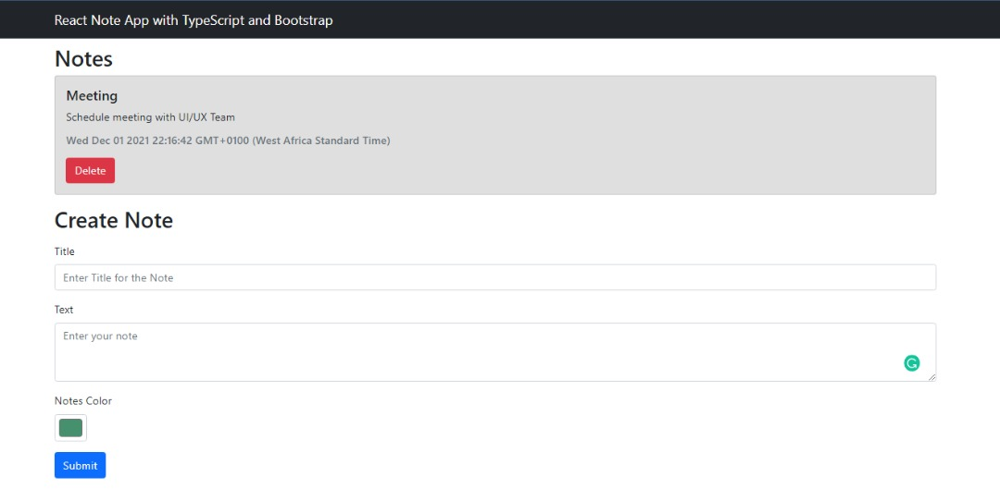

# Note App

This repository is a Note App where you can create and delete notes, you can also change the color of your notes. 

## Built With
JavaScript
Bootstrap
React
TypeScript

### Setup
clone to you local machine
create a directory on a your local machin.
open your terminal and type: git clone https://github.com/chidiebereojingwa/NoteApp.git

### Usage
Clone project to your local machine 
you can run:
npm start

## Authors

👤 **Author1**

- GitHub: [@githubhandle](https://github.com/chidiebereojingwa)
- Twitter: [@twitterhandle](https://twitter.com/ojingwa)
- LinkedIn: [LinkedIn](https://linkedin.com/in/chidiebereojingwa)

